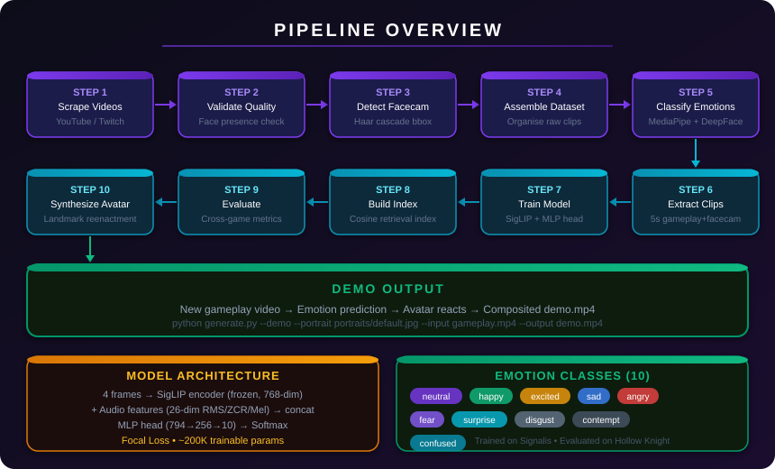

<div align="center">


**An end-to-end AI pipeline that watches gameplay footage and generates a synthetic streamer avatar that reacts — trained on real Twitch/YouTube streamers playing Signalis.**

[](https://python.org)
[](https://pytorch.org)
[](https://huggingface.co/google/siglip-base-patch16-224)
[](https://mediapipe.dev)
[](https://wandb.ai)

*Built for the StartupHack 2025 AI challenge*

</div>

---

## How it works



The pipeline runs in 10 steps — from raw Twitch VODs to a fully synthetic reacting avatar:

| Step | Module | What it does |
|------|--------|--------------|
| 1 | `streamer-dataset-builder` | Scrapes Signalis VODs from YouTube/Twitch |
| 2 | `face-validator` | Removes low-quality/no-face/VTuber videos |
| 3 | `streamer-separator` | Detects facecam bounding box per video |
| 4 | `dataset-assembler/assemble.py` | Organises raw footage + bbox + audio |
| 5 | `dataset-assembler/classify_emotions.py` | Extracts rich emotion signals (1 frame/5s) |
| 6 | `dataset-assembler/extract_clips.py` | Cuts paired 5s gameplay + facecam clips |
| 7 | `model/train.py` | Trains SigLIP + MLP emotion predictor |
| 8 | `model/generate.py --build_index` | Builds cosine-similarity retrieval index |
| 9 | `model/evaluate.py` | Evaluates on cross-game footage |
| 10 | `model/synthesize.py` | Animates avatar portrait with predicted emotion |

---

## Demo

Given any gameplay video, the model predicts the streamer's emotional state every 8 seconds and animates a synthetic avatar face accordingly:

```bash
# Download eval gameplay (Hollow Knight — unseen game)
cd eval-scraper
python scrape_eval_games.py --max_per_game 1 --max_duration 300

# Generate demo video with animated avatar
cd model
python generate.py --demo \
  --portrait portraits/default.jpg \
  --input ../eval-scraper/data/hollow_knight/<video_id>/gameplay.mp4 \
  --output demo.mp4
```

The output `demo.mp4` shows:
- Full gameplay video
- AI avatar in the corner, face animating to match predicted emotion
- Emotion label + confidence shown on the avatar

---

## Emotion signals captured

Each clip's `meta.json` captures:

| Signal | Description |
|--------|-------------|
| `emotion` | Dominant label — 10 classes |
| `scores` | Per-emotion scores 0–100 |
| `arousal` | Facial activation intensity 0–1 |
| `valence` | Affective tone −1 (negative) … +1 (positive) |
| `surprise` | Eye/brow/mouth widening response 0–1 |
| `tension` | Brow furrow + lip press + squint 0–1 |
| `blendshapes` | 52 raw MediaPipe expression coefficients |
| `head_pose` | Yaw / pitch / roll in degrees |
| `head_motion` | Nose-tip displacement since previous sample |
| `audio.*` | RMS, pitch, speech ratio, audio emotion label |

**Emotion classes:** `neutral` `happy` `excited` `sad` `angry` `fear` `surprise` `disgust` `contempt` `confused`

---

## Model architecture

```
Gameplay clip (5s)
    │
    ├─ 4 frames ──► SigLIP encoder (frozen)  ──► 768-dim
    │                google/siglip-base-patch16-224
    │
    └─ Audio    ──► RMS + ZCR + Mel bands    ──►  26-dim
                    (ffmpeg → numpy)
                                                    │
                                              concat (794-dim)
                                                    │
                                            Linear(794 → 256)
                                                  GELU
                                                Dropout
                                            Linear(256 → 10)
                                                Softmax
                                                    │
                                        Soft emotion distribution
                                          (10 emotion classes)
```

**Training:** Class-weighted focal loss · ~200K trainable params (head only) · WandB logging

**Retrieval:** Predicted emotion vector → cosine similarity → best-matching facecam clip from index

**Synthesis:** Predicted emotion → landmark delta offsets → Delaunay triangle warp → animated avatar

---

## Quick start

```bash
pip install -r requirements.txt
# System deps: ffmpeg  (winget install ffmpeg / apt install ffmpeg)
```

```bash
# Full pipeline (skipping scraping if you already have videos)
python run_pipeline.py --skip_scrape --emotion_backend deepface

# From training onwards
python run_pipeline.py --skip_scrape --skip_validate --skip_bbox \
  --skip_assemble --skip_emotions --skip_clips --emotion_backend deepface
```

### Pipeline flags

| Flag | Skips |
|------|-------|
| `--skip_scrape` | Step 1 — scrape & download |
| `--skip_validate` | Step 2 — face validation |
| `--skip_bbox` | Step 3 — bbox detection |
| `--skip_assemble` | Step 4 — dataset assembly |
| `--skip_emotions` | Step 5 — emotion classification |
| `--skip_clips` | Step 6 — clip extraction |
| `--skip_train` | Step 7 — model training |
| `--skip_index` | Step 8 — retrieval index |
| `--skip_eval` | Step 9 — evaluation |
| `--emotion_backend` | `mediapipe` (default) / `fer` / `deepface` |
| `--max_videos N` | Limit scraping to N videos |

---

## Emotion backends

| Backend | Notes |
|---------|-------|
| `mediapipe` | 52 blendshape coefficients → custom mapping. Fast, no GPU needed |
| `fer` | CNN on FER2013. 7 standard classes |
| `deepface` | Ensemble model + post-processing to fix surprise/fear mislabeling. Most accurate |

---

## WandB tracking

```bash
python model/train.py --wandb_key YOUR_KEY
```

Logs: per-batch focal loss · epoch metrics (top-1/top-3/macro-F1) · confusion matrix · dataset artifact · gameplay + facecam frame inspection galleries per emotion class

---

## Cross-game evaluation

The model is trained exclusively on **Signalis** footage and evaluated on **Hollow Knight** and **Little Nightmares** — similar atmospheric horror/action games — to test generalisation.

```bash
cd eval-scraper
python scrape_eval_games.py --games "hollow knight" "little nightmares" --max_per_game 3
```

---

## Directory structure

```
run_pipeline.py                   pipeline orchestrator
requirements.txt
assets/                           logo + diagrams
streamer-dataset-builder/         YouTube/Twitch scraper
face-validator/                   face presence + quality filter
streamer-separator/               facecam bbox detection
dataset-assembler/
    assemble.py                   raw data organiser
    classify_emotions.py          face + audio signal extractor
    extract_clips.py              paired clip cutter
    dataset/                      per-video clips (gitignored)
model/
    train.py                      SigLIP + MLP training
    generate.py                   retrieval index + demo generation
    evaluate.py                   cross-game evaluation
    synthesize.py                 face reenactment + avatar animation
    dataset.py                    PyTorch dataset loader
    portraits/                    avatar portrait images
    checkpoints/                  saved model weights (gitignored)
eval-scraper/
    scrape_eval_games.py          eval footage scraper
```
